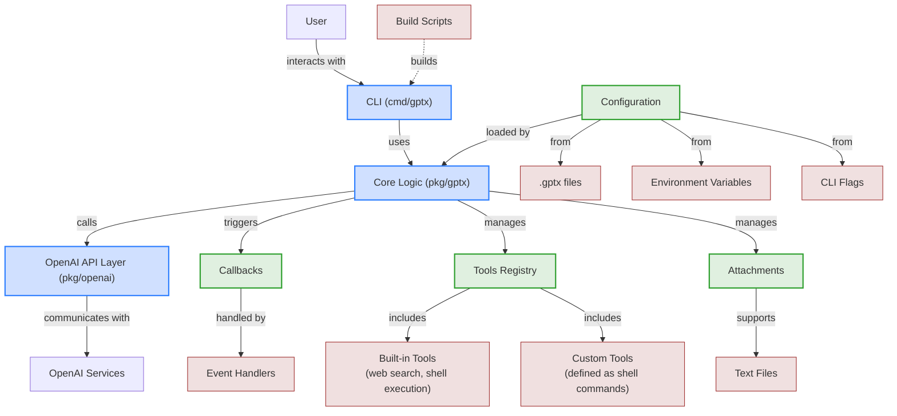
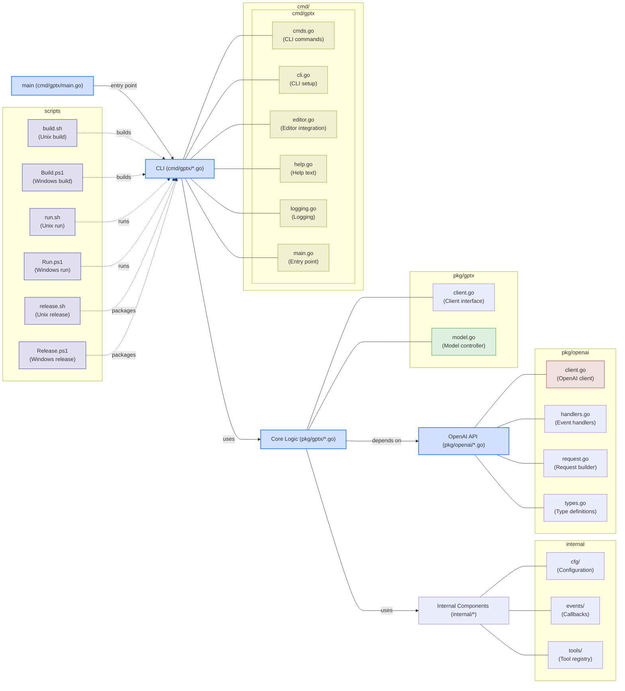
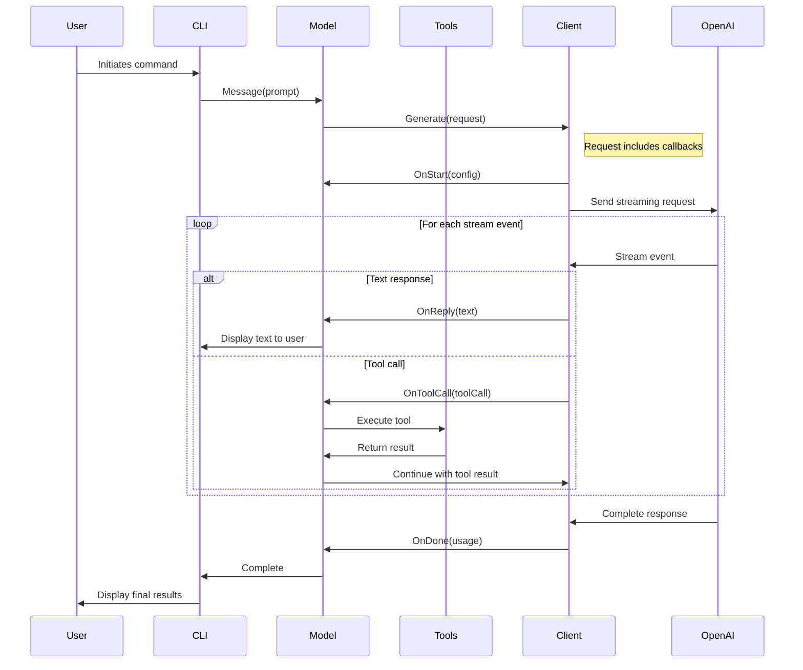
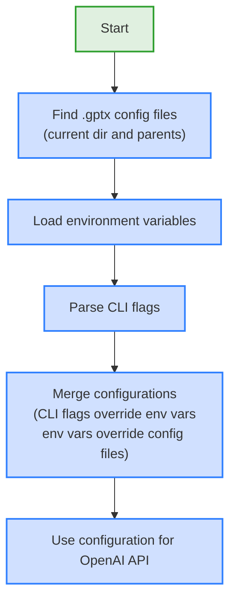
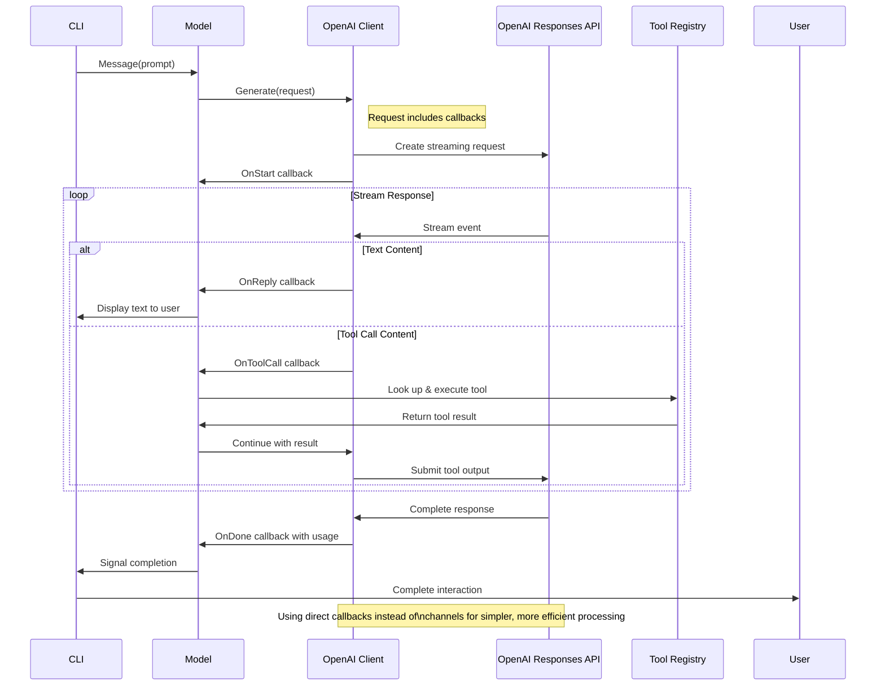
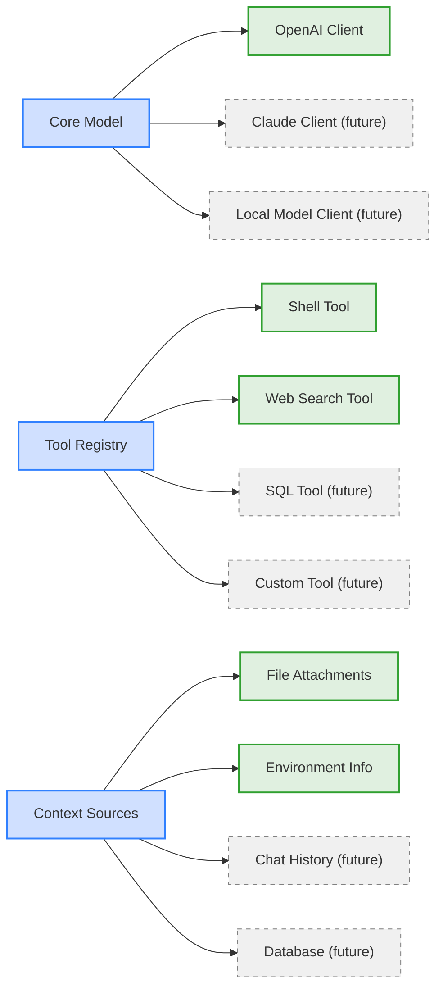

# GPTx CLI Architecture

This document outlines the architecture of the GPTx CLI using Mermaid diagrams.

## Component Architecture



## Package Structure

GPTx CLI follows a clean architecture with separation of concerns between the CLI interface, core business logic, and API integrations. The codebase is organized into three main layers:

1. **CLI Layer** (`cmd/gptx`): User-facing commands and terminal interactions
2. **Core Logic** (`internal/`): Configuration, events, and tools management
3. **API Layer** (`pkg/`): Model interfaces and OpenAI API integration



## Callback System



## Configuration Flow



## Tool Execution Flow

```mermaid
flowchart TD
    start[Start] --> receiveToolCall["Receive tool call from OpenAI"]

    receiveToolCall --> callHandlers["Call OnToolCall handler"]

    callHandlers --> lookupTool["Look up tool in registry"]

    lookupTool --> executeTool["Execute tool with parameters"]

    executeTool --> collectResults["Collect tool results"]

    collectResults --> callResultHandler["Call OnToolResult handler"]

    callResultHandler --> returnResults["Return results to OpenAI"]

    returnResults --> end[End]

    classDef process fill:#d0e0ff,stroke:#3080ff,stroke-width:2px;
    classDef callback fill:#e0f0e0,stroke:#30a030,stroke-width:2px;
    classDef terminal fill:#f0e0e0,stroke:#a03030,stroke-width:2px;

    class start,end terminal;
    class receiveToolCall,lookupTool,executeTool,collectResults,returnResults process;
    class callHandlers,callResultHandler callback;
```

## Responses API Integration



## Tool Integration

The new tool system provides a unified registry that makes it easy to add custom tools:

```mermaid
flowchart TD
    start[Start] --> createRegistry["Create tool registry"]
    createRegistry --> registerBuiltIn["Register built-in tools\nbased on config"]
    registerBuiltIn --> registerCustom["Register custom tools\n(future extension)"]

    registerCustom --> modelSetup["Set up model with registry"]

    modelSetup --> receiveToolCall["Receive tool call during generation"]

    receiveToolCall --> lookupTool["Look up tool in registry"]

    lookupTool --> executeTool["Execute tool with parameters"]

    executeTool --> returnResult["Return result to client"]

    returnResult --> continueGeneration["Continue model generation"]

    continueGeneration --> end[End]

    classDef process fill:#d0e0ff,stroke:#3080ff,stroke-width:2px;
    classDef terminal fill:#e0f0e0,stroke:#30a030,stroke-width:2px;

    class start,end terminal;
    class createRegistry,registerBuiltIn,registerCustom,modelSetup,receiveToolCall,lookupTool,executeTool,returnResult,continueGeneration process;
```

## Future Extensibility

The new architecture is designed for easy extension in several areas:



The refactored architecture enables:

1. **Custom Tools**: Register custom tools through the unified tool registry
2. **Chat History**: Can be added as a client-side feature without changing core interfaces
3. **Context Providers**: New sources of context (beyond files) can be added through the model configuration
4. **Client Implementations**: Alternative clients can implement the simple client interface
