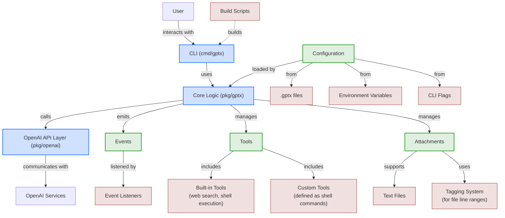
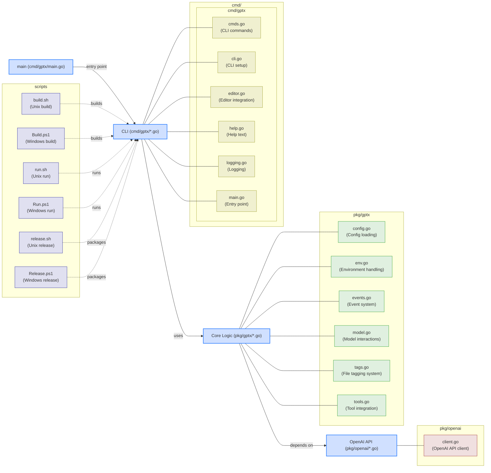
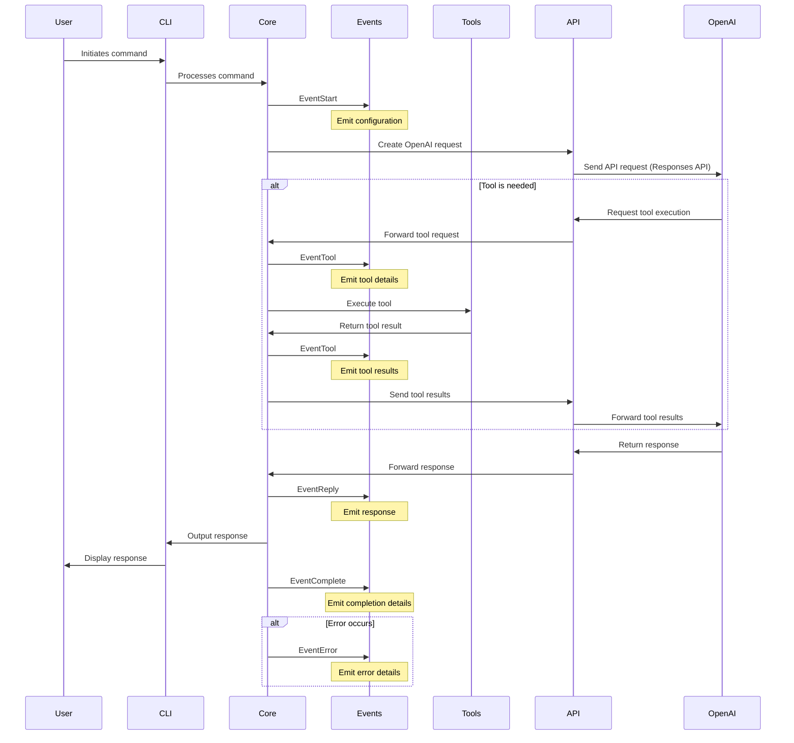
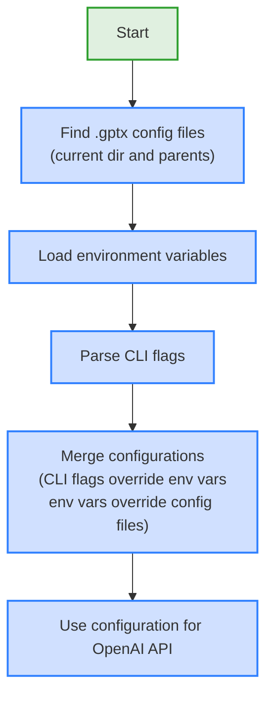
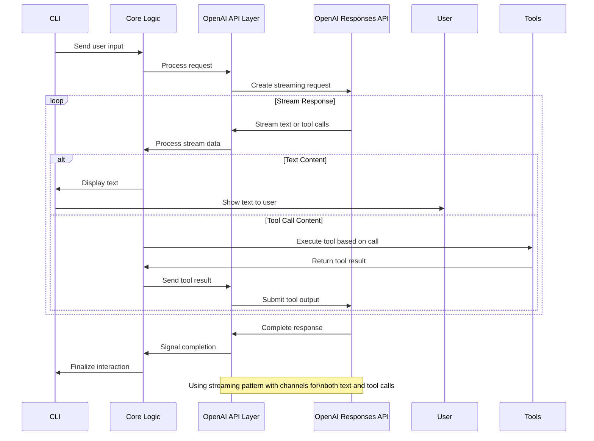

# GPTx CLI Architecture

This document outlines the architecture of the GPTx CLI using Mermaid diagrams.

## Component Architecture



## Package Structure



## Event System



## Configuration Flow



## Tool Execution Flow

```mermaid
flowchart TD
    start[Start] --> receiveToolCall["Receive tool call from OpenAI"]

    receiveToolCall --> emitToolEvent["Emit EventTool event with params"]

    emitToolEvent --> executeTool["Execute registered tool function"]

    executeTool --> collectResults["Collect tool results"]

    collectResults --> emitResultEvent["Emit EventTool event with results"]

    emitResultEvent --> returnResults["Return results to OpenAI"]

    returnResults --> end[End]

    classDef process fill:#d0e0ff,stroke:#3080ff,stroke-width:2px;
    classDef event fill:#e0f0e0,stroke:#30a030,stroke-width:2px;
    classDef terminal fill:#f0e0e0,stroke:#a03030,stroke-width:2px;

    class start,end terminal;
    class receiveToolCall,executeTool,collectResults,returnResults process;
    class emitToolEvent,emitResultEvent event;
```

## Responses API Integration


